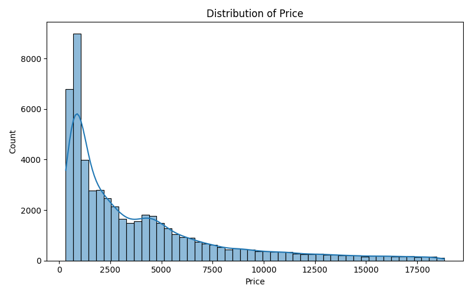
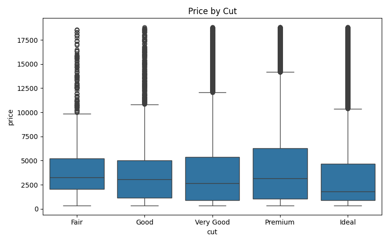
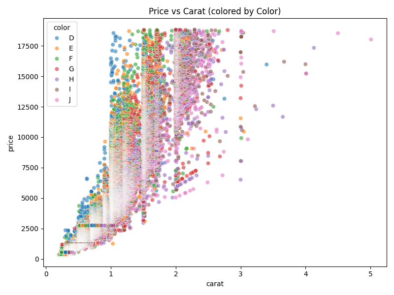
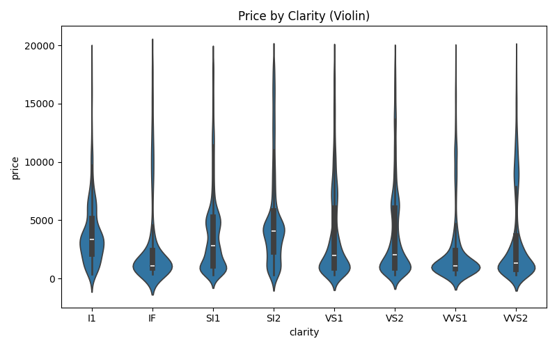
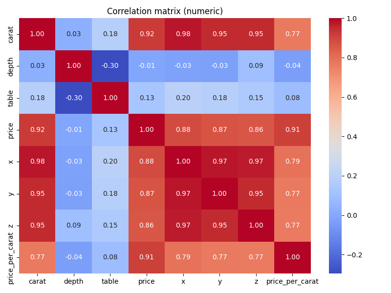
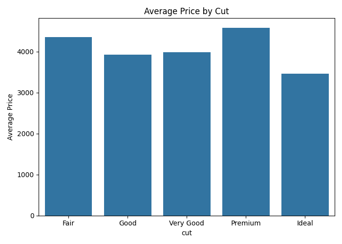

# Diamonds dataset EDA

Dataset loaded from seaborn: `sns.load_dataset("diamonds")`

**Shape:** (53940, 11)

## Columns

`carat`, `cut`, `color`, `clarity`, `depth`, `table`, `price`, `x`, `y`, `z`, `price_per_carat`

## Sample

|    |   carat | cut     | color   | clarity   |   depth |   table |   price |    x |    y |    z |   price_per_carat |
|---:|--------:|:--------|:--------|:----------|--------:|--------:|--------:|-----:|-----:|-----:|------------------:|
|  0 |    0.23 | Ideal   | E       | SI2       |    61.5 |      55 |     326 | 3.95 | 3.98 | 2.43 |           1417.39 |
|  1 |    0.21 | Premium | E       | SI1       |    59.8 |      61 |     326 | 3.89 | 3.84 | 2.31 |           1552.38 |
|  2 |    0.23 | Good    | E       | VS1       |    56.9 |      65 |     327 | 4.05 | 4.07 | 2.31 |           1421.74 |
|  3 |    0.29 | Premium | I       | VS2       |    62.4 |      58 |     334 | 4.2  | 4.23 | 2.63 |           1151.72 |
|  4 |    0.31 | Good    | J       | SI2       |    63.3 |      58 |     335 | 4.34 | 4.35 | 2.75 |           1080.65 |

## Descriptive Statistics (Summary) ✅

### Numeric summary

|       |   count |       mean |         std |   min |    25% |     50% |     75% |      max |
|:------|--------:|-----------:|------------:|------:|-------:|--------:|--------:|---------:|
| carat |   53940 |    0.79794 |    0.474011 |   0.2 |   0.4  |    0.7  |    1.04 |     5.01 |
| depth |   53940 |   61.7494  |    1.43262  |  43   |  61    |   61.8  |   62.5  |    79    |
| table |   53940 |   57.4572  |    2.23449  |  43   |  56    |   57    |   59    |    95    |
| price |   53940 | 3932.8     | 3989.44     | 326   | 950    | 2401    | 5324.25 | 18823    |
| x     |   53940 |    5.73116 |    1.12176  |   0   |   4.71 |    5.7  |    6.54 |    10.74 |
| y     |   53940 |    5.73453 |    1.14213  |   0   |   4.72 |    5.71 |    6.54 |    58.9  |
| z     |   53940 |    3.53873 |    0.705699 |   0   |   2.91 |    3.53 |    4.04 |    31.8  |

### Skewness and Kurtosis

|       |   skewness |   kurtosis |
|:------|-----------:|-----------:|
| carat |   1.11665  |   1.25664  |
| depth |  -0.082294 |   5.73941  |
| table |   0.796896 |   2.80186  |
| price |   1.6184   |   2.1777   |
| x     |   0.378676 |  -0.618161 |
| y     |   2.43417  |  91.2146   |
| z     |   1.52242  |  47.0866   |

### Unique counts (per column)

|         |   unique_count |
|:--------|---------------:|
| carat   |            273 |
| cut     |              5 |
| color   |              7 |
| clarity |              8 |
| depth   |            184 |
| table   |            127 |
| price   |          11602 |
| x       |            554 |
| y       |            552 |
| z       |            375 |

### Value counts (categorical)

**cut**

| cut       |   count |
|:----------|--------:|
| Ideal     |   21551 |
| Premium   |   13791 |
| Very Good |   12082 |
| Good      |    4906 |
| Fair      |    1610 |

**color**

| color   |   count |
|:--------|--------:|
| G       |   11292 |
| E       |    9797 |
| F       |    9542 |
| H       |    8304 |
| D       |    6775 |
| I       |    5422 |
| J       |    2808 |

**clarity**

| clarity   |   count |
|:----------|--------:|
| SI1       |   13065 |
| VS2       |   12258 |
| SI2       |    9194 |
| VS1       |    8171 |
| VVS2      |    5066 |
| VVS1      |    3655 |
| IF        |    1790 |
| I1        |     741 |

### Price per Carat (derived)

|       |   price_per_carat |
|:------|------------------:|
| count |          53940    |
| mean  |           4008.39 |
| std   |           2012.67 |
| min   |           1051.16 |
| 25%   |           2477.94 |
| 50%   |           3495.2  |
| 75%   |           4949.6  |
| max   |          17828.8  |

### Correlation matrix (numeric)

|                 |     carat |      depth |      table |      price |          x |          y |         z |   price_per_carat |
|:----------------|----------:|-----------:|-----------:|-----------:|-----------:|-----------:|----------:|------------------:|
| carat           | 1         |  0.0282243 |  0.181618  |  0.921591  |  0.975094  |  0.951722  | 0.953387  |         0.769744  |
| depth           | 0.0282243 |  1         | -0.295779  | -0.0106474 | -0.0252892 | -0.0293407 | 0.0949239 |        -0.0356695 |
| table           | 0.181618  | -0.295779  |  1         |  0.127134  |  0.195344  |  0.18376   | 0.150929  |         0.0847004 |
| price           | 0.921591  | -0.0106474 |  0.127134  |  1         |  0.884435  |  0.865421  | 0.861249  |         0.912377  |
| x               | 0.975094  | -0.0252892 |  0.195344  |  0.884435  |  1         |  0.974701  | 0.970772  |         0.787692  |
| y               | 0.951722  | -0.0293407 |  0.18376   |  0.865421  |  0.974701  |  1         | 0.952006  |         0.772065  |
| z               | 0.953387  |  0.0949239 |  0.150929  |  0.861249  |  0.970772  |  0.952006  | 1         |         0.765884  |
| price_per_carat | 0.769744  | -0.0356695 |  0.0847004 |  0.912377  |  0.787692  |  0.772065  | 0.765884  |         1         |

## Visualizations & Cross-tables ✅

### Price Distribution 🔧

**Associated pivot / summary:**

| price              |   count |
|:-------------------|--------:|
| (307.503, 2175.7]  |   25335 |
| (2175.7, 4025.4]   |    9328 |
| (4025.4, 5875.1]   |    7393 |
| (5875.1, 7724.8]   |    3878 |
| (7724.8, 9574.5]   |    2364 |
| (9574.5, 11424.2]  |    1745 |
| (11424.2, 13273.9] |    1306 |
| (13273.9, 15123.6] |    1002 |
| (15123.6, 16973.3] |     863 |
| (16973.3, 18823.0] |     726 |

### Price by Cut (boxplot) 🔧

**Associated pivot / summary:**

| cut       |   median |      q1 |      q3 |     IQR |
|:----------|---------:|--------:|--------:|--------:|
| Ideal     |   1810   |  878    | 4678.5  | 3800.5  |
| Premium   |   3185   | 1046    | 6296    | 5250    |
| Very Good |   2648   |  912    | 5372.75 | 4460.75 |
| Good      |   3050.5 | 1145    | 5028    | 3883    |
| Fair      |   3282   | 2050.25 | 5205.5  | 3155.25 |

### Price vs Carat (mean price pivot) 🔧

**Associated pivot / summary:**

| carat_bin      |        D |        E |        F |        G |        H |        I |        J |
|:---------------|---------:|---------:|---------:|---------:|---------:|---------:|---------:|
| (0.195, 0.801] |  1514.78 |  1444.91 |  1496.38 |  1335.28 |  1242.32 |  1239.12 |  1149.99 |
| (0.801, 1.402] |  6115.32 |  5807.97 |  6038.32 |  6151.58 |  5088.19 |  4670.43 |  4281.77 |
| (1.402, 2.004] | 11969.8  | 12089.4  | 12535.5  | 12428.5  | 10466.4  |  9802.57 |  8363.25 |
| (2.004, 2.605] | 16198.9  | 16098.8  | 15658.1  | 15080.4  | 15158.7  | 15124.7  | 13808.4  |
| (2.605, 3.206] | 13156    | 13049    | 14305.5  | 14188.8  | 13942.1  | 15361.1  | 14326.1  |
| (3.206, 3.808] | 15964    |   nan    |   nan    |   nan    | 12185    | 14369    | 18701    |
| (3.808, 4.409] |   nan    |   nan    |   nan    |   nan    | 17329    | 15603.5  | 15223    |
| (4.409, 5.01]  |   nan    |   nan    |   nan    |   nan    |   nan    |   nan    | 18274.5  |

### Price by Clarity (violin) 🔧

**Associated pivot / summary:**

| clarity   |   median |    mean |
|:----------|---------:|--------:|
| IF        |     1080 | 2864.84 |
| VVS1      |     1093 | 2523.11 |
| VVS2      |     1311 | 3283.74 |
| VS1       |     2005 | 3839.46 |
| VS2       |     2054 | 3924.99 |
| SI1       |     2822 | 3996    |
| SI2       |     4072 | 5063.03 |
| I1        |     3344 | 3924.17 |

### Correlation Matrix 🔧

**Associated pivot / summary:**

|                 |   carat |   depth |   table |   price |      x |      y |     z |   price_per_carat |
|:----------------|--------:|--------:|--------:|--------:|-------:|-------:|------:|------------------:|
| carat           |   1     |   0.028 |   0.182 |   0.922 |  0.975 |  0.952 | 0.953 |             0.77  |
| depth           |   0.028 |   1     |  -0.296 |  -0.011 | -0.025 | -0.029 | 0.095 |            -0.036 |
| table           |   0.182 |  -0.296 |   1     |   0.127 |  0.195 |  0.184 | 0.151 |             0.085 |
| price           |   0.922 |  -0.011 |   0.127 |   1     |  0.884 |  0.865 | 0.861 |             0.912 |
| x               |   0.975 |  -0.025 |   0.195 |   0.884 |  1     |  0.975 | 0.971 |             0.788 |
| y               |   0.952 |  -0.029 |   0.184 |   0.865 |  0.975 |  1     | 0.952 |             0.772 |
| z               |   0.953 |   0.095 |   0.151 |   0.861 |  0.971 |  0.952 | 1     |             0.766 |
| price_per_carat |   0.77  |  -0.036 |   0.085 |   0.912 |  0.788 |  0.772 | 0.766 |             1     |

### Average Price by Cut 🔧

**Associated pivot / summary:**

| cut       |   avg_price |
|:----------|------------:|
| Fair      |     4358.76 |
| Good      |     3928.86 |
| Very Good |     3981.76 |
| Premium   |     4584.26 |
| Ideal     |     3457.54 |

